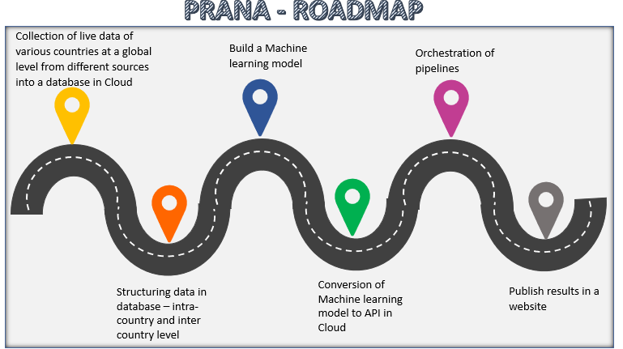

# Prana-Life-Force
Call for code Global Challenge 2021 

## Short description

### What's the problem?

Predict level of CO2 for better and healthier environment.

### How can technology help?

NGOs and Government can use this predictive tool to check levels of CO2 per capita and based on this take necessary actions to reduce the impact and make a world healthier and safer place to live in.

### The idea

Predict CO2 emission per capita considering different reasons like deforestation, CO2 emission from different sources, etc. Propose a solution as which factor should be reduced and measures to be taken to control CO2 levels.

## Demo video

## The architecture

1. The user navigates to the UI to check CO2 levels.
2. Watson Studio runs the backened code to forecast CO2 per capita level for input provided.
3. Real time data is fetched using cloud database storage.

## Long description

[More detail is available here](./Description.md)

## Project roadmap

The project currently does the following things.

- Reads data
- Structures the data
- Creates machine learning model
- Forecasts value
- Publishes result on Power BI

See below for our proposed schedule on next steps after Call for Code 2021 submission.

## Built with

- IBM Watson Studio - The cloud platform for coding
- Power BI - Frontend UI

